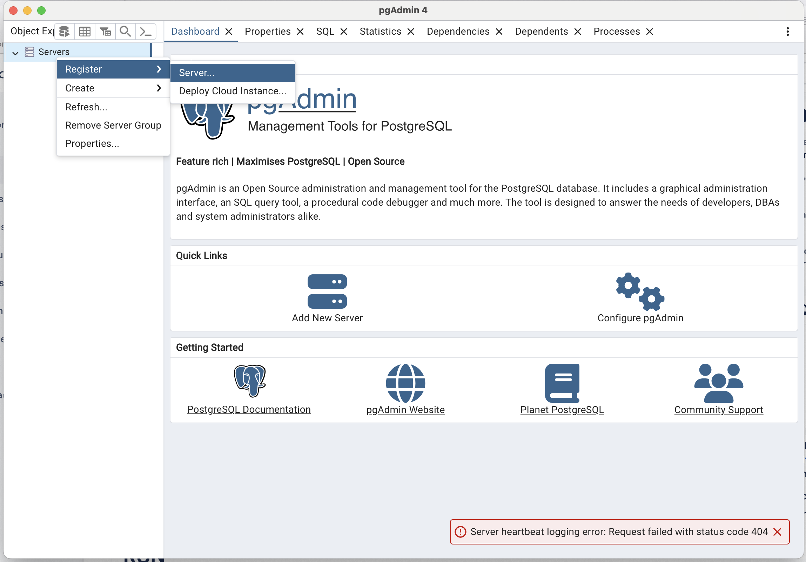
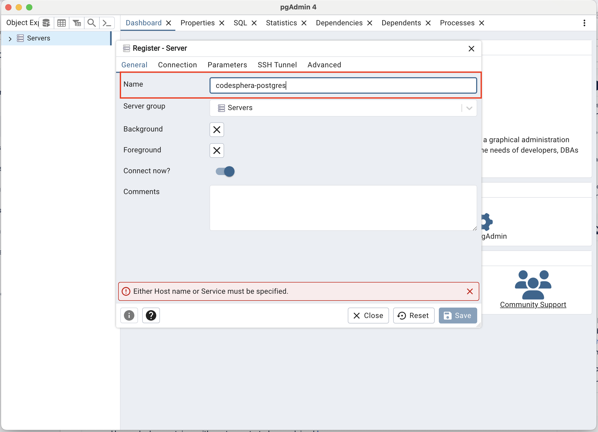
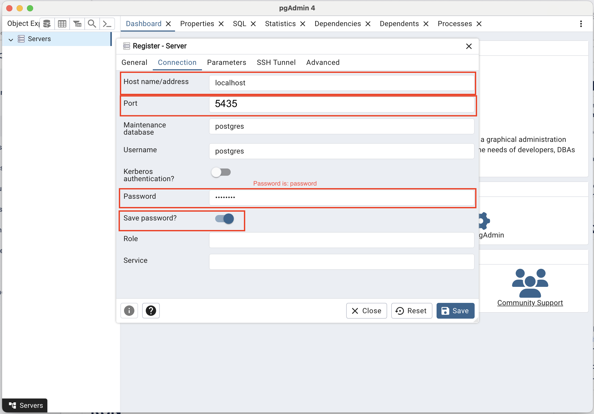

# Boilerplate go

## Instalation

- install [goose](https://github.com/pressly/goose)
    - show how to create a migration
- connect to the db from go
- install sqlc 
- ...

## Install docker

Installation [instructions](https://docs.docker.com/desktop/setup/install)

For Mac:
- make sure to open the app before 

For Linux:
- add the user to the docker group `sudo usermod -aG docker <username>`
- check the docker service `systemctl status docker`, and if it's not active execute `systemctl enable --now docker`

--

Check the docker installation with `docker run hello-world`
Start the database docker container with `docker compose up -d` in the project's directory
Check the container with `docker ps`

## Install pgadmin4

[Ubuntu](https://www.pgadmin.org/download/pgadmin-4-apt/)

[Mac](https://formulae.brew.sh/cask/pgadmin4)

### Connect to the database with PgAdmin

Register a new server



Give it a name



Give it it's properties (the password is `password`) :))



## Intall go

### Using goenv

Execute the following code:
```
shell=$(basename "$(echo $SHELL)") 
case $shell in
  zsh) rcfile="$HOME/.zshrc" ;;
  bash) rcfile="$HOME/.bashrc" ;;
  *) >&2 echo "unsupported shell" && exit 1
esac

git clone https://github.com/go-nv/goenv.git ~/.goenv

echo 'export GOENV_ROOT="$HOME/.goenv"' >> "$rcfile"
echo 'export PATH="$GOENV_ROOT/bin:$PATH"' >> "$rcfile"
echo 'eval "$(goenv init -)"' >> "$rcfile"
echo 'export PATH="$GOROOT/bin:$PATH"' >> "$rcfile"
echo 'export PATH="$PATH:$GOPATH/bin"' >> "$rcfile"

exec $SHELL
```

then go to the project's directory and execute:
```
goenv install
go run .
```

### Directly

For Mac: `brew install go`

For Linux and Windows: [instructions](https://go.dev/doc/install#install)

then go to the project's directory and execute:
```
go run .
```

## Install direnv 

[For Windows]( https://gist.github.com/rmtuckerphx/4ace28c1605300462340ffa7b7001c6d )

[For Mac]( https://formulae.brew.sh/formula/direnv )

then install the direnv hook:
```
shell=$(basename "$(echo $SHELL)") 
case $shell in
  zsh) rcfile="$HOME/.zshrc" ;;
  bash) rcfile="$HOME/.bashrc" ;;
  *) >&2 echo "unsupported shell" && exit 1
esac

echo "eval \"\$(direnv hook $shell)\"" >> "$rcfile"

exec $SHELL
```

then go to the project's directory and execute:
```
direnv allow
```
you should see something like this
```
direnv: loading ~/prog/tmp/curs1_boilerplate/.envrc                    
direnv: export +DB_CONNECTION_STRING +GOOSE_DBSTRING +GOOSE_DRIVER +GOOSE_MIGRATION_DIR
```
